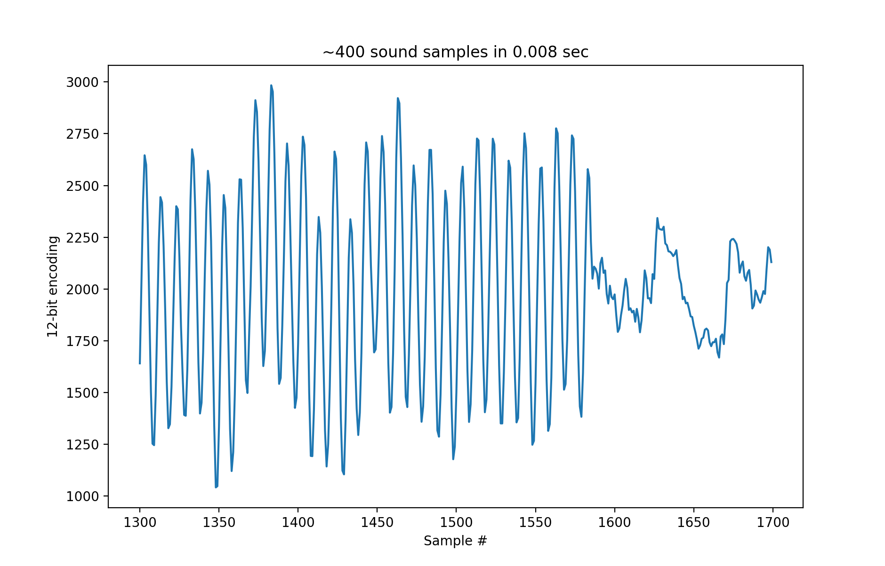
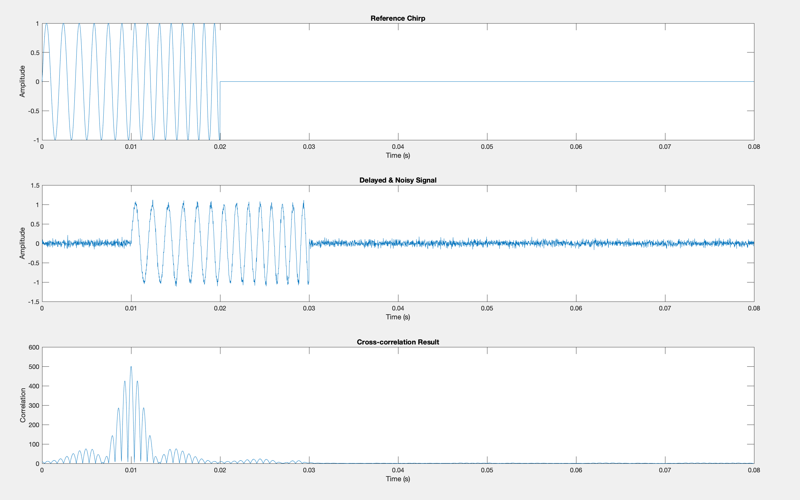

# Acoustic Localization
UCSD Coordinated Robotics Lab

Using a BeagleBone Blue, sound signals were sampled and analyzed for distance measurements. Sound was created using a speaker and sampled at a distance. The libpruio library was used to speed up the ADC sampling rate on the BeagleBone by accessing its PRU in SAMPLING.cpp. Using the fftw library, a cross-correlation algorithm was implemented on the sampled sound signal, comparing it with the reference frequency-modulated signal in Cross Correlation.cpp. The combined sampling and cross correlation gives a distance measurement in localization.cpp. Then, the distance measurements from 4 different speakers playing towards the main sampling computer can be combined in Megha's matlab algorithm to produce its 2D coordinates. We are currently in the process of syncing the clocks between the computers producing the sound signal and the computer sampling it.

# Libpruio Setup:

On your BeagleBone, 

uname -r
sudo /opt/scripts/tools/update_kernel.sh --bone-kernel --lts-4_19
sudo nano /boot/uEnv.txt

You should see: 

    uname_r=< your kernel version here (ie like 4.19.142-bone56) >
    
    enable_uboot_overlays=1
    
    disable_uboot_overlay_emmc=1
    disable_uboot_overlay_audio=1
    disable_uboot_overlay_wireless=1
    disable_uboot_overlay_adc=1
    
    uboot_overlay_pru=/lib/firmware/AM335X-PRU-UIO-00A0.dtbo
    
    cmdline=coherent_pool=1M net.ifnames=0 lpj=1990656 rng_core.default_quality=100 quiet video=HDMI-A-1:800x480@60e

Save the file and then sudo reboot. Once rebooted:

lsmod | grep uio
ls -l /dev/uio*

You should see: 

    $ lsmod | grep uio
    uio_pruss              16384  0
    uio_pdrv_genirq        16384  0
    uio                    20480  2 uio_pruss,uio_pdrv_genirq
    $ ls -l /dev/uio*
    crw-rw---- 1 root users 243, 0 Mai 17 07:25 /dev/uio0
    crw-rw---- 1 root users 243, 1 Mai 17 07:25 /dev/uio1
    crw-rw---- 1 root users 243, 2 Mai 17 07:25 /dev/uio2
    crw-rw---- 1 root users 243, 3 Mai 17 07:25 /dev/uio3
    crw-rw---- 1 root users 243, 4 Mai 17 07:25 /dev/uio4
    crw-rw---- 1 root users 243, 5 Mai 17 07:25 /dev/uio5
    crw-rw---- 1 root users 243, 6 Mai 17 07:25 /dev/uio6
    crw-rw---- 1 root users 243, 7 Mai 17 07:25 /dev/uio7

Then, to bypass security issues with Debian Jessie being an outdated OS:

sudo nano /etc/apt/sources.list

    deb [trusted=yes] http://beagle.tuks.nl/debian jessie/
    deb-src [trusted=yes] http://beagle.tuks.nl/debian jessie/

Add the keyring:

  wget -qO - http://beagle.tuks.nl/debian/pubring.gpg | sudo apt-key add -
  
  sudo apt-get update

Or...

  sudo apt-get update --allow-unauthenticated
  
  (You should just see a single error thats like “unsupported binary format”. Ignore this)

sudo apt-get install libpruio

sudo apt-get install libpruio-dev libpruio-lkm libpruio-doc

The you should be good to go.

# Output

Example sound sampling from SAMPLING.cpp at 100 kHz using the PRU (200 kHz is overkill for this project):

Output from the theoretical cross-correlation algorithm, demonstrated in matlab for plotting:

The signal is shifted by 0.01 seconds, and despite the noise the cross-correlation technique accurately reflects that shift. With noisier
signals, the peak will be less clear but still fare better than non-frequency-modulated signals.

